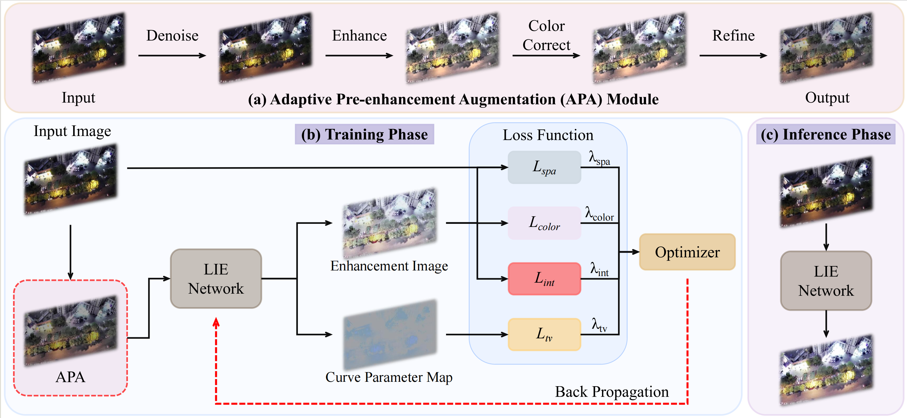

# U3LIE: A Benchmark, Metric and Framework for Unsupervised UHR UAV Low-Light Image Enhancement

This is the official PyTorch implementation of the paper: <br/>
> **Unsupervised Ultra-High-Resolution UAV Low-Light Image Enhancement: A Benchmark, Metric and Framework**
>
>

### The complete U3D toolkit will be publicly available after the paper is accepted.


---

<p align="center"> 
<!-- TODO: 确认您的图片路径是正确的 -->

<p align="center">  Illustration of the U3LIE framework, including the training-only APA module and the inference pipeline.
</p> 

---


## Abstract
Low-light conditions significantly degrade Unmanned Aerial Vehicles (UAVs) performance in critical applications. Existing Low-light Image Enhancement (LIE) methods struggle with the unique challenges of aerial imagery, including Ultra-High Resolution (UHR), lack of paired data, severe non-uniform illumination, and deployment constraints. To address these issues, we propose three key contributions. First, we present **U3D**, the first unsupervised UHR UAV dataset for LIE, with a unified evaluation toolkit. Second, we introduce the **Edge Efficiency Index (EEI)**, a novel metric balancing perceptual quality with key deployment factors: speed, resolution, model complexity, and memory footprint. Third, we develop **U3LIE**, an efficient framework with two training-only designs—Adaptive Pre-enhancement Augmentation (APA) for input normalization and a Luminance Interval Loss ($\mathcal{L}_{int}$) for exposure control. U3LIE achieves SOTA results, processing 4K images at 23.8 FPS on a single GPU, making it ideal for real-time on-board deployment.


## Results and Pre-trained Models

### The U3D Dataset
Our **U3D (Unsupervised UHR UAV Dataset)** is the cornerstone of this work. It contains 1,000 UHR (3840×2160) low-light images and 1,000 non-paired daytime images.

- **Download the U3D Dataset:** 
The dataset can be downloaded at [Baidu netdisk](https://pan.baidu.com/s/1zOrA9JorLbvyGVI5MV8jwg?pwd=CV21)(Password: CV21) or [Google Drive](https://drive.google.com/file/d/1jhij6FLIxuhZZANYEy4IyxzbzBi4fW2m/view?usp=sharing).

### Model Performance
U3LIE achieves a new state-of-the-art balance between enhancement quality and efficiency on the U3D benchmark.

| Method | Type | PI $\downarrow$ | EEI $\downarrow$ | FPS (4K) $\uparrow$ | Configs | Download |
|:---:|:---:|:---:|:---:|:---:|:---:|:---:|
| **U3LIE (Ours)** | **Uns** | **17.11** | **16.03** | **23.80** | [u3lie_config.py](./configs/u3lie.py) | **[Model]** |
| DCE++ | Uns | 20.82 | 56.39 | 7.68 | - | - |
| RUAS | Uns | 21.73 | 57.91 | 7.64 | - | - |
| CycleGAN | Unp | 5.76 | 120.74 | 1.38 | - | - |
| MobileIE | Sup | 22.99 | 20.50 | 26.95 | - | - |

### Visual Results
<p align="center"> 
<!-- TODO: 确认您的图片路径是正确的 -->

<p align="center">Visual comparison with state-of-the-art methods on the U3D dataset. U3LIE effectively restores details in dark regions without over-exposing bright areas or introducing color artifacts.</p> 

---
## Installation

Our U3D Toolkit is built on PyTorch. Please follow these steps for installation.

```shell
# Create a conda environment
conda create -n u3lie python=3.8 -y
conda activate u3lie

pip install git+https://github.com/chaofengc/IQA-PyTorch.git
pip install opencv-contrib-python
pip install natsort
pip install visdom
pip install thop

git clone https://github.com/U3LIE
cd U3LIE
```

# Get Started
## 1. Dataset Preparation
The dataset can be downloaded at [Baidu netdisk](https://pan.baidu.com/s/1Wg3u7V8AOVfgqkaw1n3lEg?pwd=CV21)(Password: CV21) or [Github](https://github.com/lwCVer/RRSHID/releases/download/dataset/RRSHID.zip) or [Hugging Face](https://huggingface.co/datasets/lwCVer/RRSHID/blob/main/RRSHID.zip) or [Google Drive](https://drive.google.com/file/d/1uBwHM8tyw69xafFHd01vMERs3TadUmxT/view?usp=drive_link).

Download the U3D dataset from the link provided above and organize it as follows:

```shell
U3D/
├── train/
│   ├── low/      (800 low-light images)
│   └── normal/   (800 normal-light images) (optional)
├── val/
│   ├── low/      (100 low-light images)
│   └── normal/   (100 normal-light images) (optional)
└── test/
    ├── low/      (100 low-light images)
    └── normal/   (100 normal-light images) (optional)
```

# 2. Evaluation
To evaluate our pre-trained U3LIE model on the U3D test set:

```shell
python test.py \
    --model_name u3lie \
    --weights_path /path/to/your/pretrained/u3lie_model.pth \
    --input_dir ./U3D/test/low/ \
    --output_dir ./results/u3lie/
```

# 3. Training
To train the U3LIE model from scratch:

```shell
python train.py \
    --config configs/u3lie_config.yaml \
    --data_root ./U3D/
```

# Acknowledgement
This project benefits from several open-source projects, including the work from Zero-DCE/DCE++. We thank the original authors for their contributions to the community.

# License
This work is licensed under a Creative Commons Attribution-NonCommercial 4.0 International License. Any commercial use of this project requires prior formal permission.